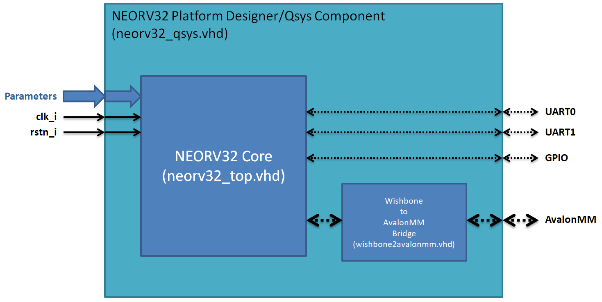
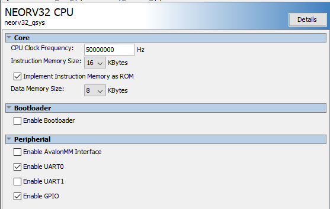

# NEORV32 Platform Designer Component

This folder contains a Qsys/Platform Designer wrapper for the NEORV32 together with
an Wishbone to AvalonMM bridge. This makes the NEORV32 a drop-in replacement for the
Altera/Intel NIOS-2 soft CPU.

This is just a quick example of a possible solution, written August 2021 by
Tore Ramsland (tore.ramsland@firmwaredesign.no).

Only some peripherials (UART0, UART1 and GPIO) are connected, but other peripherial
could easily be connected.

## Solution overview

The solution is made up of 3 files. 2 VHDL files; one file for the component implementation
(neorv32_qsys.vhd) and one file for the Wishbone to AvalonMM bridge. There is also
a Qsys component file (neorv32_qsys_hw.tcl) specifying the Qsys component and GUI.
The figure below shows how the component is implemented.



## GUI Settings

The Qsys component is created so that some parameters can be set in the Platform Design
GUI. More settings could be added as needed.



## Implementation notes

The Platform Designer has a bug (feature?) that makes boolean parameters from the Platform
Designer GUI being port mapped to the VHDL component generic as 0/1 instead of true/false. 
This is a known bug/feature.

A workaround for this is made by making the generic (boolean) parameters in the VHDL
as "integer", and then use a "integer2bool" function to make the parameter boolean
again to fit the NEORV32 top.

## How to use

To use the Qsys component in your Platform Designer design, you will just need to
make a "User_Components.ipx" file in your Qsys folder, and reference this (rtl/templates/neorv32_qsys_component) folder.

Example "User_Components.ipx" content:
```
<library>
	<path path="../../../rtl/templates/neorv32_qsys_component/**/*" />
</library>
```

You will also need to add 3 lines in your Quartus project file (QSF-file) in order to
get the correct source files.

Example QSF-file info:
```
......
set_global_assignment -name QIP_FILE ../../../rtl/templates/neorv32_qsys_component/neorv32_qsys.qip
set_global_assignment -name VHDL_FILE ../../../rtl/core/neorv32_application_image.vhd
set_global_assignment -name VHDL_FILE ../../../rtl/core/neorv32_bootloader_image.vhd
......
```

Having seperate links for the bootloader and application images makes it easy to include images
from your own project folders.

# NEORV32 Platform Designer Component - Example Design

The branch contains an example design using the Qsys/Platform designer component
and running on the DE0 Nano board.

The example design can be found at "setups/quartus/de0-nano-test-setup-qsys".

The example design will run the software examples.
